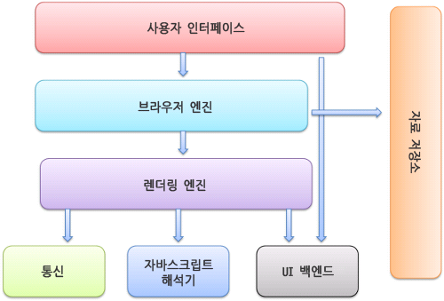
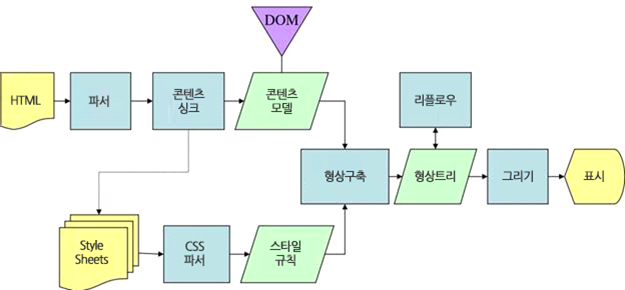

# Front-End 

 

### 브라우저의 기본 구성 

 - 출처 : https://d2.naver.com/helloworld/59361

브라우저의 구성은 다음과 같습니다.

- 사용자 인터페이스 - 요청한 자원과는 별도의 브라우저가 가지고있는 버튼 혹은 탭, 즐겨찾기 등
- 브라우저 엔진 - 인터페이스와 렌더링 사이에서 동작 제어
- 렌더링 엔진 - 요청한 자원의 응답을 가지고 화면에 표시(HTML, CSS 파싱 등)
- 통신 - HTTP/HTTPS 요청과 같은 네트워크 호출시 사용
- 자바스크립트 해석기 - Javascript 코드를 해석하고 실행
- UI 백엔드 - 기본적인 장치(콤보 박스, 텍스트 박스)를 그리며 사용자 인터페이스에 따라 달라짐
- 자료 저장소 - 자료를 저장하는 부분(쿠키, 웹 데이터 베이스 등)

 

### 브라우저에서 렌더링 과정 

렌더링 엔진에서 렌더링 과정을 진행하며 종류는 웹킷(Webkit - 크롬, 사파리)과 게코(Gecko - 파이어폭스)등이 존재합니다.

 - 출처 : https://d2.naver.com/helloworld/59361

렌더링 엔진은 사용자가 요청한 자원을 얻는 것부터 시작을 합니다. 보통 8KB 단위로 문서가 전송이 되며 이 데이터가 모두 받아졌을때 렌더링을 시작하는 것이 아닌 즉각 렌더링을 실행합니다.

위 그림을 보면 렌더링 엔진은 우선 HTML 문서를 파싱하고 태그들을 DOM 노드로 변환합니다. 이때, 스타일 요소도 파싱을하며 DOM 트리와 스타일 요소를 합쳐 렌더 트리라는 또 다른 트리를 생성하게 됩니다.

렌더 트리가 구축이 되면 다음으로는 트리의 노드들을 정확한 위치에 자리를 잡도록 배치 작업에 들어갑니다. 배치 작업이 끝난 뒤에는 UI 백엔드에서 렌더 트리의 각 노드들을 보며 그리기를 시작합니다.

위 설명은 웹킷을 기준으로 했으며, 개코의 경우 렌더 트리를 형상 트리라 하며 배치(layout)가 아닌 리플로우(reflow)라고 부릅니다. 또한, DOM 노드와 스타일 요소를 연결하는 과정을 웹킷에서는 어태치먼트(attachment)라고 하며, 게코에서는 콘텐츠 싱크(content sink)라는 과정이 존재합니다.

- 웹킷의 렌더링 과정

- 게코의 렌더링 과정

   - 출처 : https://d2.naver.com/helloworld/59361

위 그림과 같이 웹킷과 게코가 다른 부분이 있지만, 의미적으로는 똑같은 동작을 하는 것을 알 수 있습니다.
